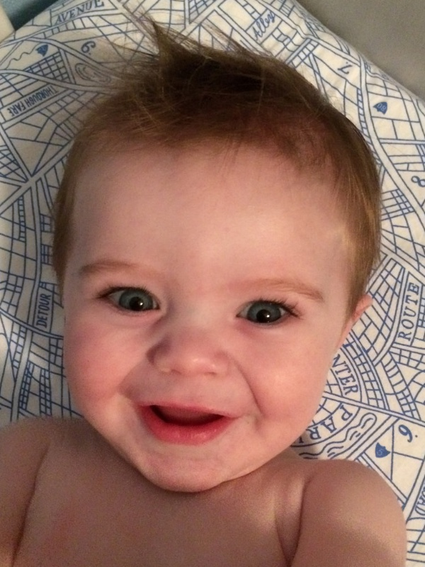
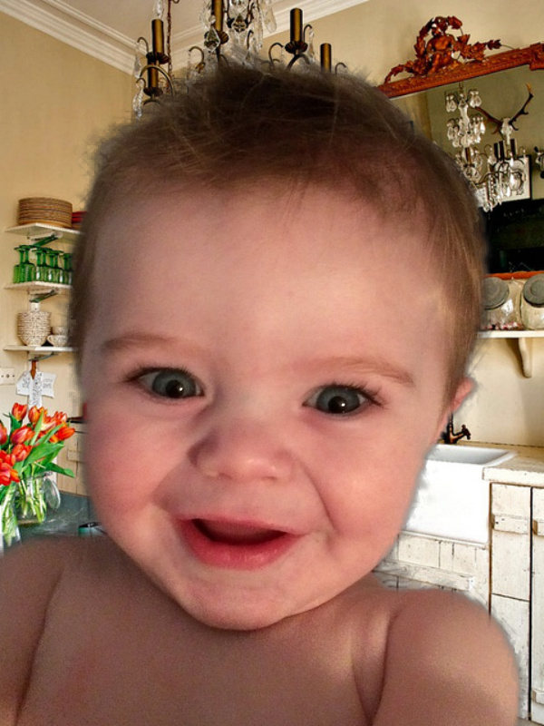
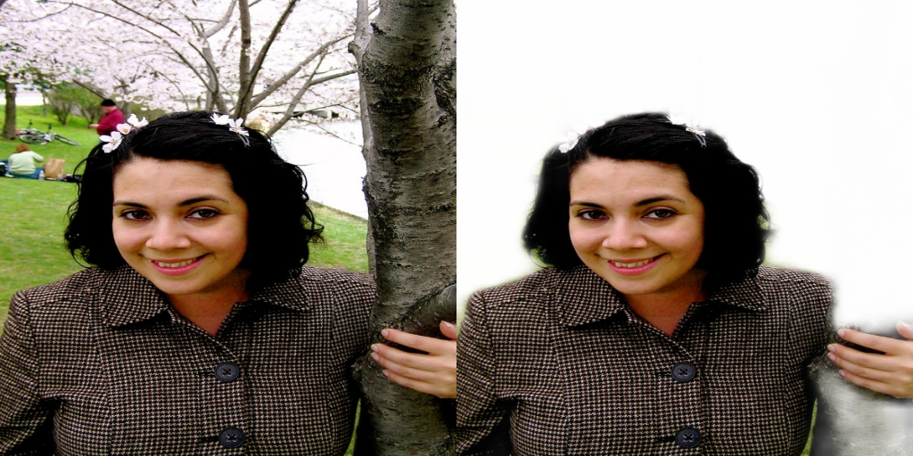
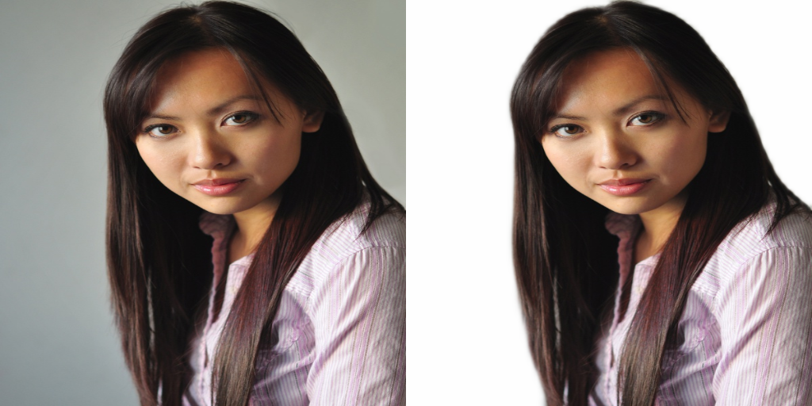

## 人像分割

## 使用场景

* 证件照制作
* 集体照拼接
* 人像换背景

## 数据集：

* Automatic Portrait Matting

Portrait 数据集由香港中文大学于2016年发布，是当前标注质量较高的数据集之一。
共有2000张自拍人像图像，1700训练、300测试。

下载地址：

>  http://www.cse.cuhk.edu.hk/~leojia/projects/automatting/

* 爱分割数据集

该数据集为目前已知最大的人像matting数据集，**包含 34427 张图像和对应的matting结果图**. 数据集中的原始图片来源于Flickr、百度、淘宝. 基于该数据集所训练的人像软分割模型已商用.

下载地址：

> 链接：https://pan.baidu.com/s/1R9PJJRT-KjSxh-2-3wCGxQ提取码：dzsn

## model

BiseNet-Resnet101

* Spatial分支采用小步长的策略，少降低分辨率，以保留更多空间信息
* Context分支采用快速下降分辨率的策略，使特征具有丰富的感受野
* 最后利用特征融合模块FFM，将两个分支特征进行融合即可输出

## tricks

* CEloss+Diceloss

  从概率和区域衡量模型

  

  

  CEDiceloss = CEloss+Diceloss

* 数据融合

  从COCO数据集中寻找无人像的数据，将训练数据与其融合，可以增加数据丰富度

  代码：

  ~~~python
  class PortraitDataset_fusion(PortraitDataset2000):
      def __init__(self, root_dir, transform=None, in_size=224 , coco_dir=None,coco_datatype = "val2017",fusion_ration=0.3):
          super(PortraitDataset_fusion,self).__init__(root_dir, transform, in_size)
          self.cocodir = coco_dir
          self.fusion_ration = fusion_ration
          super_cats_in = ["outdoor", "indoor"]
          super_cats_out = ["person"]
          self.coco_genertor = CocoImg(self.cocodir, coco_datatype,super_cats_in,super_cats_out)
      def __getitem__(self, index):
          path_label = self.label_path_list[index]
          path_img = path_label[:-10] + ".png"
          img_bgr = cv2.imread(path_img)
          msk_rgb = cv2.imread(path_label)  # 3个通道值是一样的 # 0-255，边界处是平滑的
          if random.random() < self.fusion_ration:
              _, back_path = random.choice(self.coco_genertor)
              img_bgr = self.fusion(img_bgr, msk_rgb, back_path)
          img_rgb = cv2.cvtColor(img_bgr, cv2.COLOR_BGR2RGB)
          # step2: 图像预处理
          if self.transform:
              transformed = self.transform(image=img_rgb, mask=msk_rgb)
              img_rgb = transformed['image']
              msk_rgb = transformed['mask']   # transformed后仍旧是连续的
  
          # step3：处理数据成为模型需要的形式
          img_rgb = img_rgb.transpose((2, 0, 1))      # hwc --> chw
          img_chw_tensor = torch.from_numpy(img_rgb).float()
  
          msk_gray = msk_rgb[:, :, 0]                 # hwc --> hw
          msk_gray = msk_gray/255.                    # [0,255] scale [0,1] 连续变量
          label_tensor = torch.tensor(msk_gray, dtype=torch.float)  # 标签输出为 0-1之间的连续变量 ，shape=(224, 224)
  
          return img_chw_tensor, label_tensor
      def fusion(self,raw_img,for_mask,coco_path):
          mask_img = for_mask / 255
          back_img = cv2.imread(coco_path)
          fore_img = np.clip(raw_img * mask_img, a_min=0, a_max=255).astype(np.uint8)
  
          h, w, c = fore_img.shape
          back_img = cv2.resize(back_img, (w, h))
  
          result = np.clip(fore_img * mask_img + back_img * (1 - mask_img), a_min=0, a_max=255).astype(np.uint8)
  
          return result
  ~~~

  效果：fusion前->fusion后

   

* 数据增强(albumentations工具)

  * HorizontalFlip(p=0.5)
  * Blur(blur_limit=7, p=0.5)
  * ColorJitter(brightness=0.2, contrast=0.2, saturation=0.2, hue=0.2, p=1)
  * IAAAffine(translate_percent=0.1, p=0.5), 
  * IAAAffine(rotate=(-10, 10), p=0.5)

* 在3w爱分割数据集下infer模型并将miou<0.8的加入模型训练：

  * infer后数据量1813

在Automatic Portrait Matting数据集下训练得到模型

| CE+DIceloss | 数据增强 | fusion | 增加数据 | miou   |
| ----------- | -------- | ------ | -------- | ------ |
| no          | no       | no     | no       | 0.9682 |
| Yes         | no       | no     | no       | 0.9712 |
| yes         | yes      | no     | no       | 0.9736 |
| yes         | yes      | yes    | no       | 0.9743 |
| yes         | yes      | yes    | yes      | 0.9784 |

## result and badcase

1. 孔洞部分分割效果差

   

### 效果

* 在2080Ti上  FPS平均为48

最终将所有数据都加入训练